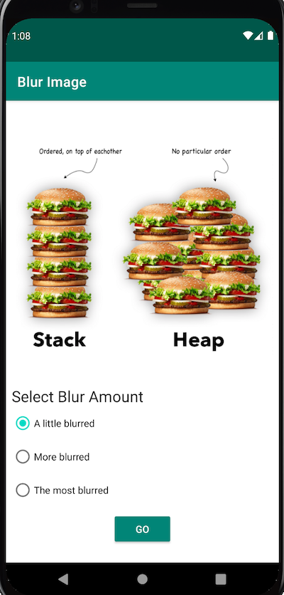
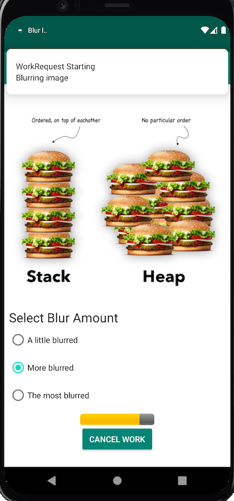
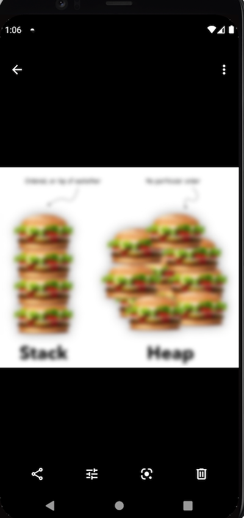

# Android WorkManager Sample

A sample application to demonstrate usage of [Workmanager](https://developer.android.com/topic/libraries/architecture/workmanager)

# What is WorkManager
`WorkManager` is an API that makes it easy to schedule reliable, asynchronous tasks that are expected to run even if the app exits or the device restarts. The `WorkManager` API is a suitable and recommended replacement for all previous Android background scheduling APIs, including `FirebaseJobDispatcher`, `GcmNetworkManager`, and `Job Scheduler`. `WorkManager` incorporates the features of its predecessors in a modern, consistent API that works back to API level 14 while also being conscious of battery life.

# WorkManager Features

### Work Constraints

Declaratively define the optimal conditions for your work to run using Work Constraints. (For example, run only when the device is on Wi-Fi, when the device is idle, or when it has sufficient storage space, etc.)

### Robust Scheduling

`WorkManager` allows you to schedule work to run one- time or repeatedly using flexible scheduling windows. Work can be tagged and named as well, allowing you to schedule unique, replaceable work and monitor or cancel groups of work together. Scheduled work is stored in an internally managed `SQLite` database and WorkManager takes care of ensuring that this work persists and is rescheduled across device reboots. In addition, WorkManager adheres to power-saving features and best practices like `Doze` mode, so you don’t have to worry about it.

### Flexible Retry Policy

Sometimes work fails. `WorkManager` offers flexible retry policies, including a configurable exponential backoff policy.

### Work Chaining

For complex related work, chain individual work tasks together using a fluent, natural, interface that allows you to control which pieces run sequentially and which run in parallel.

# Sample App

The sample app shows how to perform a background task using `WorkManager` by blurring an image from Media folder.

## Functionality

1. Ask for Read/Write Permission on Device images.
2. Select image from Media folder.
3. Apply Blur amount (litte, more, most) by choosing options.
4. Send Status `Notification` when the `workmanager` starts working.
5. `WorkManager` Periodic request like Clean Up Worker-> Blur Image Worker-> Save Image Worker.
6. `WorkManager` custom configuration.
7. Publish progress from your Worker.
8. Display work progress in the UI.
9. Save Image in a specified folder & allow users to see the resulted image after the blur operation.
10. Write instrumentation tests for your Workers.

# Screenshots

Select Image               |  Blur Image                   |   Result
:------------------------:|:------------------------:|:------------------------
    |    |   